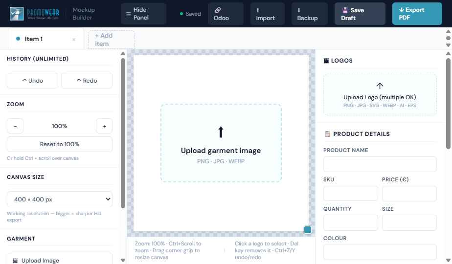
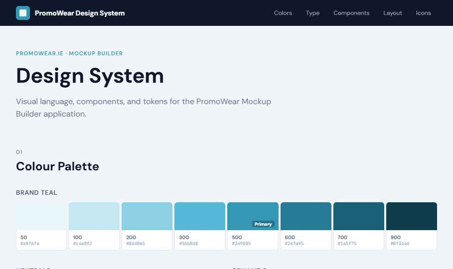
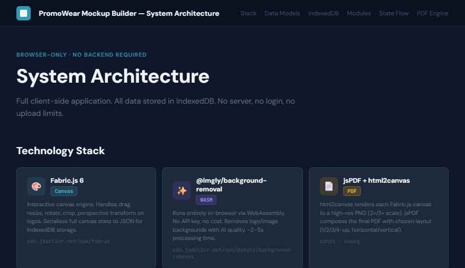
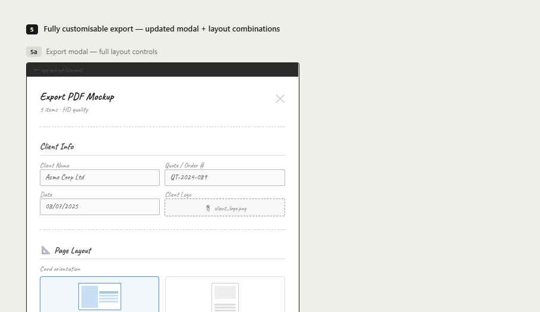
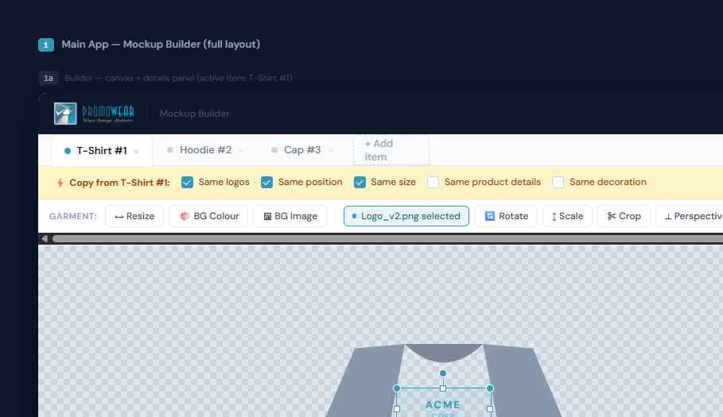

# T-Shirt Mockup Design Tool (PromoWear Mockup Builder)

A browser-based, no-install mockup builder for promotional-product businesses (t-shirts, hoodies, caps, bags, etc). Upload a garment photo, drop client logos onto it, position/resize/rotate/crop/perspective-warp them like a real design tool, fill in order details, and export a client-ready HD PDF proof — all running **entirely in the browser**, no server or account required.

Built for **PromoWear.ie** as a working example, but the tool is white-label — swap the company name/logo/accent color via props.



---

## Why this exists (the business problem)

Promotional-merchandise and print shops constantly need to show clients **what their logo will look like on a product** before production — on a t-shirt, hoodie, cap, tote bag, etc. Today that's usually done by:
- Manually compositing images in Photoshop/Illustrator per order (slow, requires a designer)
- Emailing back and forth with static images and no structured order data
- Losing track of decoration specs (thread color, placement, artwork size) between the mockup and the actual production ticket

This tool collapses that into one flow: **upload → place logo → fill in specs → export a polished PDF proof** with your company branding, the client's branding, and every production detail on one page — in minutes, without design software.

---

## What it does

- **Multi-item orders** — add as many products (tabs) as one order needs (t-shirt, hoodie, cap...), each with its own image, logos, and details
- **Real logo editing on canvas** — drag, resize, rotate, crop (draggable rectangle), and perspective-warp (drag all 4 corners) any uploaded logo directly on the garment image
- **One-click background removal** for logos or the garment photo itself
- **Custom canvas background** — solid color or an uploaded backdrop image
- **Adjustable working resolution & object sizing** — change canvas size and type exact pixel width/height for the selected object
- **Unlimited undo/redo**, zoom (Ctrl+Scroll or +/− controls), and a collapsible tool sidebar
- **"Copy from Item 1"** — tick boxes to reuse logos/position/size/details/decoration across items in the same order, still editable after
- **Full product/decoration form**: product name, SKU, qty, size, color, material, decoration type (screen print / embroidery / DTG...), placement, artwork W×H, thread/ink color, price, notes
- **Autosaves to IndexedDB** (no size limits like localStorage) + a manual "Backup" button that exports a portable `.zip` (re-importable) for cross-device transfer
- **Export as HD PDF** — fully configurable: horizontal or vertical card orientation, 1/2/3/4 products per page, company logo + client logo in the header, quote #/date, notes (bold red, sized to fit), and repeatable terms & conditions in the footer of every page
- **Odoo integration** — stubbed in the UI (`🔗 Odoo` button) for a future release: pulling product/client data from Odoo and pushing finished mockups back into Sales Orders/Invoices via a small backend proxy (browser can't call Odoo's API directly — see Architecture doc)

## Who it's for

Screen printers, embroiderers, promotional product resellers, and any small print/merch shop that needs fast, professional client-facing proofs without hiring a designer for every quote.

---

## Screenshots

| | |
|---|---|
| **App — canvas & editing tools**  | **Design system**  |
| **System architecture**  | **Wireframe explorations**  |
| **Hi-fi mockup screens**  | |

---

## Project structure

```
├── Mockup Builder.dc.html      # The actual working app (canvas editor, forms, PDF export)
├── Mockup Builder (Offline).html  # Self-contained, works fully offline / double-click to run
├── Design System.dc.html       # Color palette, type scale, component library reference
├── System Architecture.dc.html # Data models, IndexedDB schema, module breakdown, PDF pipeline
├── Wireframes.dc.html          # Early layout exploration (multiple options compared)
├── Hi-Fi Designs.dc.html       # Polished mockups of every screen before build
├── screenshots/                # Screens captured for this README
└── README.md
```

## Tech stack (100% client-side, no backend)

- **[Fabric.js](http://fabricjs.com/)** — canvas engine for drag/resize/rotate/crop/perspective on logos
- **Custom homography-based perspective warp** — live-preview corner-drag distortion (no external lib)
- **[jsPDF](https://github.com/parallax/jsPDF)** — composes the final multi-page HD PDF
- **[JSZip](https://stuk.github.io/jszip/)** — packages backup/export `.zip` files
- **IndexedDB** — autosave storage for images (as native Blobs) + form state; no 5MB localStorage ceiling
- Plain HTML/CSS/JS — no build step, no framework, opens directly in any modern browser

See `System Architecture.dc.html` for full data models, the IndexedDB schema, and the PDF rendering pipeline.

## Design system

Single accent color (`#3498B5` teal, pulled from the PromoWear logo) + neutral slate scale, DM Sans for UI text, JetBrains Mono for SKUs/codes. Full token reference, component states, and spacing scale are in `Design System.dc.html`.

## Roadmap / stubbed features

- **Odoo integration** — UI entry point exists; needs a small backend proxy to hold API credentials and relay XML-RPC/JSON-RPC calls (browser can't call Odoo directly due to CORS + credential exposure). Would sync: product details, client info, and push mockups to Sales Orders/Invoices.

## Running it

Just open `Mockup Builder.dc.html` (or `Mockup Builder (Offline).html` for a fully offline, portable single file) in any modern browser. No install, no server, no build step.

---

*Built iteratively via wireframes → hi-fi mockups → working app, all documented in this repo for reference.*
